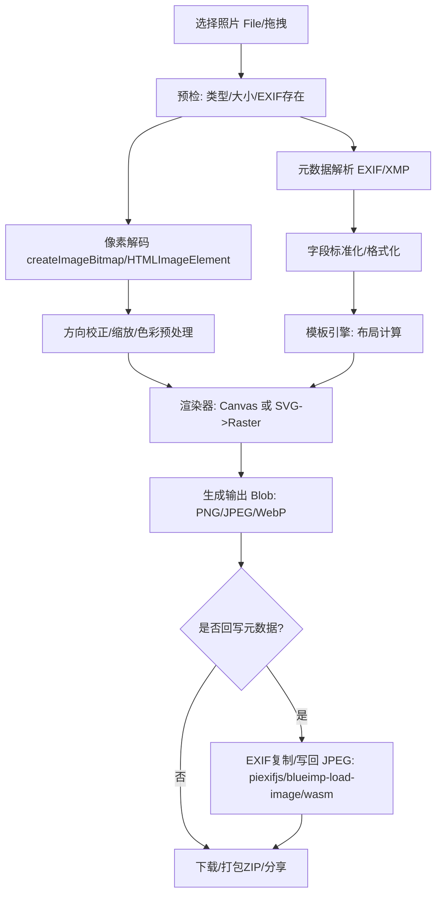
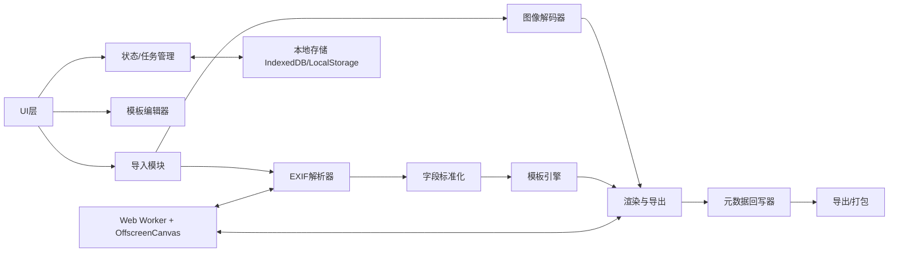

# 纯本地相机参数水印 Web App 可行性与实现方案调研报告

## 执行摘要

本报告结论是：构建一个“纯本地（浏览器端、无后端）”的相机参数水印（EXIF）Web App **技术上完全可行**，并且已有多个开源项目证明了核心闭环（导入图片 → 读取 EXIF → 套用模板 → 导出）的可落地性与可用性，例如 **无忧相机水印**强调“无服务、本地处理”并提供批量导入导出与模板模式，citeturn14view1turn50view0turn51view0 **EZMark**明确支持 PWA 离线并给出 HEIC 方案，citeturn15view2turn32view0turn55view1turn56view0 而 **gen-brand-photo-pictrue**在仓库内直接实现了 Service Worker 资源缓存来达成离线可用。citeturn46view0turn46view1

真正的工程难点集中在三处：  
其一是**跨格式兼容**（尤其 HEIC/HEIF）——在浏览器层面长期存在支持差异与授权成本问题，需要“浏览器原生支持 + WASM 转码兜底”的组合策略；citeturn44search0turn44search6turn33search3 其二是**导出后保留/回写元数据**——多数基于 Canvas/DOM 截图导出的实现会丢失 EXIF，需要额外的“EXIF 复制/写入链路”（JPEG 场景最现实）；citeturn42search2turn33search2turn42search3turn14view3 其三是**批量与性能**——高像素原片在浏览器内存与主线程上压力很大，现有项目甚至主动限制单次张数以避免崩溃。citeturn50view0

在开源对比中，**技术路线最接近“纯本地+可离线+可兼容 HEIC”目标的是 EZMark 与 gen-brand-photo-pictrue**（都明确给出离线线索），citeturn15view2turn46view0 **元数据保留能力最值得借鉴的是 exif-frame**（曾修复“导出图片无元数据”的缺陷，且依赖中包含 EXIF 恢复相关库），citeturn57view1turn8view0 但它也出现了“引入 Cloudflare Workers 后端基础设施”的发布记录，意味着其“严格纯前端”属性需要谨慎验证与隔离。citeturn57view1turn45view2

## 结论与可行性评估

纯本地 Web App 的定义边界需要先明确：  
“无后端”通常指不把用户图片上传到服务器；但在工程上，依然可能存在“静态资源 CDN”“版本检查/更新”“埋点/日志上报”等网络行为。要做到严格“离线可用”，必须通过 **Service Worker + Cache Storage** 缓存关键静态资源，以便在网络不可用时仍可启动应用并完成核心功能。citeturn43search0turn43search4turn43search8

从浏览器能力看，核心技术点成熟度如下：

- **文件导入与本地处理**：使用 `<input type="file">`、拖拽等方式可行；若想提升“批量导入/导出体验”，可选用 File System Access API（如 `showOpenFilePicker()`/`showSaveFilePicker()`），但该能力在 MDN 上属于“实验性/非 Baseline”，需要对兼容性保持保守预期。citeturn43search1turn43search9turn43search17  
- **离线存储与缓存**：IndexedDB 适合存储模板、预设、任务队列乃至少量产生的中间文件（Blob），并能支撑离线工作流。citeturn43search2turn43search6  
- **图像解码与性能**：`createImageBitmap()` 提供异步且相对高效的解码路径，`OffscreenCanvas` 允许把渲染/导出搬到 Worker，降低主线程卡顿，对批量处理尤其关键。citeturn43search7turn43search3turn43search19  

在“相机参数水印”这个细分场景里，**EXIF 读取并不难**，难的是“处理后导出仍保留元数据”。一些库或项目直接指出压缩/重编码后 EXIF 会被移除，例如 Compressor.js 的 README 明确提示“压缩后 Exif 信息会被移除”。citeturn42search2 同时也存在可用的补救方向：  
- `piexifjs` 提供 `load/dump/insert`，可把 EXIF 写回 JPEG 数据（DataURL 或二进制字符串），更适合“导出 JPEG 并复制原图 EXIF段”的路线。citeturn33search2  
- `blueimp/JavaScript-Load-Image` 提到可“恢复完整图像头部（header）”以及处理 Orientation 等，属于“在前端做元数据保留”的典型工具链之一。citeturn42search3turn42search6  

最后是格式兼容：  
- 对 HEIC/HEIF，生态仍分裂。“Can I use”指出 HEIF/HEIC 支持困难与授权成本，且 AVIF/JPEG XL 被作为替代方向。citeturn44search0 另一方面，entity["company","Apple","technology company"] 的 Safari 17 Release Notes 显示 Safari 新增了对 HEIC/HEIF 图片的支持，意味着在 Apple 生态下可直接读取与解码的可能性更高。citeturn44search6  
- 为保证跨浏览器一致体验，仍建议把 HEIC 视为需要“前端转码兜底”的格式（WASM/纯前端转换），例如 `heic2any` 宣称在浏览器端把 HEIC/HEIF 转为 JPEG/PNG/GIF。citeturn33search3turn33search7  

综合来看：**纯本地相机参数水印 Web App 的可行性高**；迭代策略上应优先交付“本地处理+多模板+批量导出”，随后再把“EXIF 回写/保留”和“HEIC 全端一致”作为 v2/v3 的核心增量能力。

## 开源项目与在线工具对比

本节覆盖并对比用户指定的 7 个项目，并补充若干相关仓库与在线工具。以下对比的“离线判定”优先使用 README/源码线索（如“无服务、本地处理”、Service Worker、PWA 声明），并明确标注未实测 DevTools Offline 的情况。

### 主要开源 Web App 对比表

| 项目 | 功能：EXIF 字段（明确出现/使用） | 功能：模板样式 | 批量 | PWA/离线 | HEIC 支持 | 导出是否保留 EXIF | 自定义模板/保存 | 技术栈（从 README/源码/依赖归纳） | License | 在线 demo（仓库给出的链接） | 优缺点要点 | 离线依据（README/源码） |
|---|---|---|---|---|---|---|---|---|---|---|---|---|
| dearDreamWeb/camera-watermark（无忧相机水印）citeturn14view1turn50view0turn51view0turn17view2 | 明确建模并展示：FocalLength、FNumber、ExposureTime、ISO、Model、LensModel（另有 Make 等）citeturn50view0turn51view0 | 至少“经典/背景模糊”两种模板（TemplateMode），底部元素可拖拽编辑citeturn14view1turn51view0 | 支持批量导入/导出/预览，但项目内设 MAX=5 以防系统崩溃citeturn14view1turn50view0 | README 强调“无服务、本地处理”；未见 PWA/SW 配置线索citeturn14view1turn51view0 | README/页面提示：主要面向相机 JPEG/TIFF 等原片；未提 HEICciteturn14view1turn50view0 | 导出逻辑保存为 PNG（`saveFile(...png)`），一般不保留 EXIFciteturn51view0 | 支持保存默认参数到 localStorage（defaultParams），并使用 IndexedDB 记录编辑信息citeturn50view0turn51view0 | React + Vite + Tailwind + Fabric + exifr + Dexie/IndexedDB + Workerciteturn14view1turn8view2turn50view0turn51view0 | 未标注（仓库根目录未见 LICENSE）citeturn17view2 | 仓库页提供站点入口；README 给出国内/entity["company","Vercel","cloud platform"] 地址citeturn17view0turn15view3 | 优点：信息架构完整（批量/缓存/编辑/模板）；缺点：导出 PNG 导致元数据保留难、批量上限较保守 | README 声明本地处理；工程上可 Docker 自部署（更可控的离线）citeturn14view1turn17view2 |
| jeonghyeon-net/exif-frame（EXIF Frame）citeturn58view1turn14view2turn57view1turn8view0 | README 只笼统描述“显示 EXIF metadata”；Release 提到 DateTime/DateTimeOriginal、FocalLength bug、Crop Factor；支持手动编辑元数据citeturn14view2turn57view0turn57view1 | 多主题（SIMPLE、FILM、LIGHTROOM、STRAP、ONE LINE、TWO LINE 等），并持续迭代 divider、透明度、排序等citeturn57view0turn57view2 | Release 提到“collage 功能（实验室）”但未直接等价于“批量导出”；依赖含 JSZip/FileSaver，可能具备多文件打包能力（需读源码确认）citeturn57view0turn8view0 | **存在引入后端的发布记录**（Cloudflare Workers）；同时 web/bundle.js 生成指向站点 zip 的版本信息，意味着可能依赖网络更新citeturn57view1turn45view2 | Release 明确提到“仅接收 JPEG 文件”调整citeturn57view1 | v0.4.100 变更日志出现“导出图片无元数据”的修复项，表明其在解决“导出保留元数据”问题citeturn57view1 | 支持手动编辑自动获取的 EXIF（README）；支持自定义排序/全局覆盖等citeturn14view2turn57view2 | React + Vite + Tailwind；ExifReader + exif-restorer；JSZip/FileSaver；Capacitor（mobile 目录）citeturn8view0turn8view1turn58view0 | GPL-3.0citeturn58view0 | exif-frame.yuru.cam（仓库页）citeturn58view1 | 优点：模板体系丰富、对“导出无元数据”有明确修复轨迹；缺点：GPL 许可对二次开发约束大，且出现后端基础设施迹象 | README 未承诺离线；发布记录显示网络相关基础设施，严格“纯本地”需审计与裁剪citeturn57view1turn45view2 |
| printlin/OnlineImageWatermark（Camera Vision）citeturn15view0turn9view1turn7view3 | README 说明“Exif 信息读取/参数自动读取”，但未列字段清单citeturn15view0turn9view2 | 规划/已实现：背景模糊、圆角、阴影、多字体、底部 EXIF 信息；多模板计划（纯色背景/原图背景等）citeturn15view0turn9view2 | README 明确“批量导出/导出所有”citeturn15view0turn9view2 | README 强调“无需下载直接使用”，未声明 PWA/SW；但作为静态站点可自托管citeturn15view0turn9view2 | 未声明 | README 声称“无损导出”，但是否保留 EXIF 未说明citeturn15view0 | README 说明“开放多种参数自定义”（模糊/虚化/阴影/字体/圆角等）citeturn15view0 | 代码形态更像“编译后的静态站点”；仓库未暴露源码技术栈细节citeturn9view2 | MITciteturn9view1 | lookcv.com（README）citeturn15view0turn7view3 | 优点：面向真实摄影水印场景、功能维度丰富；缺点：技术栈/元数据保留实现细节不透明 | 仅能依据 README 的“网页即开即用”描述；未看到离线缓存声明citeturn15view0 |
| kuyermqi/exif-watermark-generator（相片水印）citeturn13view0turn8view5turn24view0 | README 明确：camera model、lens used、shutter speed、aperture、ISO 等citeturn13view0 | 典型“小白条”底部信息条（README 描述）citeturn13view0 | 依赖含 JSZip/file-saver/tiny-async-pool，可能支持批量与打包（缺少 README 细节/目录页不可读，需进一步源码确认）citeturn8view5 | 未见 PWA/SW 说明 | 未说明；ExifReader 理论支持多格式，但是否能解码取决于浏览器与实现citeturn8view5turn37search10 | 未说明（常见 DOM/Canvas 导出会丢 EXIF） | 未说明 | Vue3 + Vite + ExifReader + html-to-image + JSZip/FileSaver + 压缩库citeturn8view5 | MITciteturn13view0 | exif-watermark-generator.vercel.app（仓库页）citeturn13view0 | 优点：主题明确、依赖显示有批量潜力；缺点：文档极简、导出/元数据策略不透明 | 无离线声明；需自行做 DevTools Offline 与源码审计 |
| zhiweio/picseal（Picseal）citeturn14view3turn8view7 | README 侧重实现：用 Rust 库 kamadak-exif（WASM）提取 EXIF；支持多设备品牌自动识别/自定义citeturn14view3 | “小米照片风格/莱卡水印”风格；用 HTML+CSS 生成样式，实时预览citeturn14view3 | 未突出批量 | 依赖出现 vite-plugin-pwa，推断具备 PWA 能力（需查看配置/实测）citeturn8view7 | 未声明；受浏览器可解码格式限制 | README 明确：dom-to-image 导出相当于“截图”，并提到对 JPEG 试图“复制原图 EXIF 拼接进导出图”，但自述方式粗暴且不稳定citeturn14view3 | 提到可自定义处理；未见“模板保存/分享”机制描述citeturn14view3 | React + Vite + Ant Design + Rust WASM + dom-to-image；并包含 sharp/svgo 等打包优化依赖citeturn14view3turn8view7 | MITciteturn14view3 | picseal.vercel.app / github.io 等citeturn14view3 | 优点：WASM 解析 EXIF、风格贴近手机水印；缺点：DOM 截图式导出天然带来“像素/色彩/元数据”偏差风险 | README 重点是“不上传”；离线需结合 PWA 配置与实测citeturn14view3turn8view7 |
| lecepin/gen-brand-photo-pictrueciteturn30view1turn46view0turn46view1turn46view3 | 源码明确使用/格式化：Make、Model、DateTimeOriginal、FocalLength(含 35mm)、FNumber、ExposureTime、PhotographicSensitivity(ISO)、GPSLat/GPSLonciteturn46view1turn46view3 | 模仿“小米 12S 示例照片/莱卡水印”风格（README/页面文案）citeturn15view1turn30view1 | 未突出批量 | 仓库自带 SW：install 时缓存核心资源（含 wasm），fetch 走 cache-first，属于“可离线启动”的直接证据citeturn46view0 | 未声明；实现上用 Rust exif crate 从容器读取，通常面向 JPEG/TIFF EXIFciteturn46view3 | 导出实现为 dom-to-image 生成 JPEG，再 Blob 下载；无 EXIF 回写逻辑，通常不保留citeturn46view1 | 支持识别后手动修正与自定义（README/表单）citeturn15view1turn46view1 | Rust + WASM（get_exif）+ React/AntD（CDN 形态）+ dom-to-image；含 SW 缓存citeturn46view1turn46view3turn46view0 | 未标注（根目录无 LICENSE）citeturn30view1 | GitHub Pages 工具地址citeturn30view1turn15view1 | 优点：源码非常直观、离线实现清晰、EXIF 字段覆盖含 GPS；缺点：导出不保留 EXIF、许可缺失导致复用风险 | Service Worker 明确缓存清单与 cache-first 策略citeturn46view0 |
| LavaCxx/EZMarkciteturn32view0turn55view1turn56view0turn8view4 | 源码明确展示：Model、DateTimeOriginal、FocalLength、FNumber、ExposureTime、ISOSpeedRatings 等citeturn56view0 | “Leica-like watermark”并加入主题色提取块（从图像像素聚类）citeturn56view0turn55view1 | 单张为主 | README 明确“支持 PWA 离线使用”citeturn15view2turn32view0 | 明确支持：accept 包含 .heic，且对 image/heic 走 heic2any 转 PNG；同时 README 声称支持 .heicciteturn15view2turn56view2turn55view1 | 导出为 html2canvas 截图得到 PNG（toDataURL），不保留 EXIF；尽管压缩步骤启用 retainExif，也不影响截图导出citeturn55view1turn42search2 | 可手动覆盖 model/logo/色块数量/尺寸；logo 由 logos.json 维护citeturn55view0turn55view1turn56view0 | Astro + SolidJS + ExifReader + heic2any + compressorjs + html2canvas + PWA 插件citeturn8view4turn55view1turn56view0 | MITciteturn32view0 | ezmark.lavac.ccciteturn32view0 | 优点：HEIC 方案与 PWA 离线明确、字段渲染清晰；缺点：导出 PNG（元数据保留弱） | README 明确 PWA；依赖中也含 PWA 相关插件citeturn15view2turn8view4 |

### 其他相关仓库与在线 demo 补充

补充项目的目的有二：一是补齐“批量/模板/元数据保留”的技术参考，二是提供“非纯前端/非 WebApp”的对照样本，帮助界定需求边界。

- grover572/PhotoExifMark：定位为在线工具，列出“读取 EXIF、多模板、实时预览、自定义样式、移动端适配”，技术栈为 Vue3+TS+Vite+exifr+Canvas。citeturn28view0  
- chaoyangnz/phew：不是 WebApp，而是强调“JSX 定义模板 → 渲染 SVG → 与原图合成”，并宣称“no quality loss / no metadata loss”，对“高质量合成+保 EXIF”的实现思路很有启发。citeturn27search1  
- exifframe.org：提供在线 EXIF Frame 工具（非本次指定的开源仓库），其定位与“白边框+参数展示”类似，可作为竞品体验参考（是否开源需另行确认）。citeturn3search1  
- allenxing/watermark-for-photo：更接近“API/服务端生成”，README 示例直接要求传入 exif/tiff JSON 字段（Make/Model/ExposureTime/FNumber 等），可作为“后端方案”对照。citeturn28view2  

## 产品需求规格建议

本节给出面向“纯本地、主流现代浏览器（Chrome/Safari/Firefox/Edge 最新两个版本）”的 PRD 级规格建议。需求设计会显式吸收上述开源项目的共性能力与踩坑点（例如“EXIF 丢失”“批量内存压力”“模板体系”“离线/PWA”）。

### 功能清单

核心功能建议按“导入—解析—预览—编辑—导出”闭环组织：

导入与管理层：应用应支持拖拽/点击导入，兼容单图与多图任务队列；对大像素照片必须有“任务队列/并发控制/取消”能力，否则在移动端极易出现卡死或浏览器崩溃（无忧相机水印甚至把“最多 5 张”作为保护门槛）。citeturn50view0

EXIF/元信息层：至少支持以下字段的自动解析与格式化展示，并允许逐字段手工覆盖（因为经微信/QQ 等“非文件模式”转发后 EXIF 可能变化或丢失，多个项目都明确提醒这一点）：citeturn14view1turn32view0turn50view0  
- 设备：Make、Model  
- 拍摄：DateTimeOriginal（或 TakenAt）  
- 镜头与曝光：LensModel、FocalLength（含 35mm 等效）、FNumber、ExposureTime、ISO（或 PhotographicSensitivity/ISOSpeedRatings）  
- 可选：GPS（Lat/Lon）、色彩主题（从图像取色，EZMark 的做法）citeturn46view1turn56view0turn55view1  

模板与编辑层：模板应分为“基础模板（开箱即用）”“可编辑模板（可调参数）”“自定义模板（保存/导入导出）”三档。现有项目的模板差异主要体现在：底部白条、白边框、背景模糊、字体与布局、品牌 Logo、信息块分行方式、divider/透明度等。citeturn51view0turn57view0turn15view0turn14view3

导出层：必须提供“导出当前”“批量导出（可打包 ZIP）”与质量选项；同时在产品层面明确“不上传图片、仅本地处理”。“是否保留/回写 EXIF”建议做成**显式开关**，并默认关闭 GPS 以降低隐私泄露风险（但允许用户主动开启）。citeturn14view1turn43search0turn36search18  

### 模板示例列表

建议内置至少 8 组模板，覆盖摄影圈常见风格与信息密度：

| 模板名（示例） | 布局与视觉 | 默认字段组合 | 主要可调项 |
|---|---|---|---|
| Classic Bottom Bar（白条） | 底部白条 + 左右分栏 | Model / Lens / F / S / ISO / FL | 行数、字体、Logo、间距、对齐 |
| Two-line Bar（双行） | 两行信息更清晰 | 第一行设备，第二行曝光参数 | 行距、divider、透明度（参考 exif-frame 变更）citeturn57view0turn57view2 |
| Film / Strap | 像“胶片边/相机背带铭牌” | 日期 + 设备 + 参数 | 主题、日期格式、Logo显示开关 |
| Blurred Background Frame | 背景模糊填充 + 原图居中 | 与白条类似 | 背景模糊度、阴影、圆角（参考 camera-watermark/OnlineImageWatermark）citeturn51view0turn15view0 |
| Polaroid | 底部留白更大、偏社交平台 | 日期/地点优先 | 留白比例、字体、签名 |
| Minimal One-line | 单行极简信息 | Model + F/S/ISO | 单行顺序、分隔符 |
| Leica-like Phone Stamp | 类手机厂默认水印 | Model/日期/参数/Logo | Logo比例、色块数量（参考 EZMark）citeturn56view0 |
| “无 EXIF”占位模板 | EXIF 缺失时仍可导出 | 使用默认值/手填 | 默认值保存与应用（参考 camera-watermark 的 defaultParams）citeturn50view0turn51view0 |

### UI/UX 要点

建议采用“三段式”信息架构：左侧模板/预设，中间预览画布，右侧参数面板——与一些项目的布局计划一致。citeturn15view0 同时考虑移动端，应支持“底部抽屉式参数面板”和“单手操作的导出按钮”。

一个可行的界面草图如下（示意）：

```text
┌─────────────────────────────────────────────┐
│ 顶栏：导入(拖拽/选择)  批量队列  离线状态  设置 │
├───────────────┬─────────────────────────────┤
│ 模板库/预设     │ 预览区（缩放/对比/背景）       │
│ - Classic      │ ┌─────────────────────────┐ │
│ - Film         │ │         原图区域         │ │
│ - Blur Frame   │ │                         │ │
│ - Polaroid     │ └─────────────────────────┘ │
│               │  底部信息条（可拖拽/对齐）     │
├───────────────┴─────────────────────────────┤
│ 右侧/抽屉：字段（Model/Lens/F/S/ISO/Date/GPS） │
│            样式（字体/大小/间距/divider/Logo） │
│            导出（PNG/JPEG/WebP，质量，是否复制EXIF）│
└─────────────────────────────────────────────┘
```

## 技术设计与实现方案

### 总体架构与数据流

目标是把“解析与渲染”从 UI 主线程解耦，满足批量与移动端流畅性；同时在导出链路中将“像素输出”和“元数据回写”拆分为两个独立步骤。

示例数据流程图（Mermaid）：



关键模块关系图（Mermaid）：



### 前端框架与工程选型

从开源项目实践看，React/Vue/Solid 都能胜任；关键不在框架而在“图片处理管线”。例如：  
- 无忧相机水印使用 React + Fabric + Worker，配合 IndexedDB 存储编辑信息。citeturn14view1turn50view0turn51view0  
- EZMark 采用 Astro + Solid，并把 HEIC 转换、ExifReader 解析、html2canvas 导出串在一起。citeturn8view4turn55view1turn56view0  
- gen-brand-photo-pictrue 走“轻框架 + WASM + SW”路线，同样能闭环。citeturn46view0turn46view1turn46view3  

建议：若团队偏工程化与组件生态，可选 React/Vue；若强调包体与性能，可选 Solid/Svelte。无论选型，都建议把“解析/渲染/导出”抽到 Worker 层，UI 仅做状态与预览。

### EXIF 解析库选型与理由

现实需求是：读取尽可能多的格式/字段，同时在需要时支持“回写/复制 EXIF”。

- **ExifReader**：定位是“解析并提取元数据”，并明确支持 JPEG/TIFF/PNG/HEIC/AVIF/WebP/GIF 等多格式及 Exif/IPTC/XMP/ICC/MPF 等多种元数据类型，同时强调可配置、可裁剪以得到很小的 bundle。citeturn37search10turn33search1 但它主要是“读”，社区也有“希望支持写回”的需求反馈。citeturn33search13  
- **exifr**：强调速度与多构建产物（full/lite/mini），其中 lite 描述支持 JPEG 与 HEIC，并可解析 TIFF/EXIF、XMP。citeturn33search0  
- **WASM（Rust EXIF 库）**：picseal 直接用 Rust `kamadak-exif` 解析 EXIF 并嵌入前端；citeturn14view3 gen-brand-photo-pictrue 同样以 Rust 读取容器并返回 tag/value/value_with_unit。citeturn46view3 这类方案对字段覆盖和格式化（with_unit）很友好，但需要 WASM 构建链、包体管理与跨格式验证。

建议的组合策略：  
- v1：优先用 ExifReader 或 exifr 来读取核心字段（Make/Model/DateTimeOriginal/FocalLength/FNumber/ExposureTime/ISO/LensModel）。citeturn56view0turn50view0  
- v2：为“单位格式化”和“厂商兼容（如 PhotographicSensitivity/ISOSpeedRatings）”补充标准化层；必要时引入 WASM 解析以提升一致性（参考 gen-brand 的 value_with_unit 输出）。citeturn46view3turn46view1  

### 渲染：Canvas vs CSS/SVG

现有项目可归为两派：

- **DOM/CSS 预览 + DOM 截图导出**：picseal 采用 HTML+CSS 生成样式、实时预览，再用 dom-to-image 导出；其 README 明确这相当于“屏幕截图”，导出结果与原图完全不同。citeturn14view3 EZMark 用 html2canvas 将 DOM “截图”成 PNG。citeturn55view1turn34search2  
- **Canvas 合成导出**：无忧相机水印借助 Fabric（canvas 抽象层）做拖拽编辑与导出。citeturn14view1turn50view0turn51view0

推荐：  
- 预览层可以用 DOM/CSS（开发快、布局灵活、适合模板编辑器）；  
- 导出层必须用 Canvas（或 SVG→Canvas）以获得可控的分辨率、缩放与抗锯齿，并将导出逻辑放到 Worker+OffscreenCanvas 中。citeturn43search3turn43search19  
这样可以避免 DOM 截图在移动端字体、布局、滚动视口、跨域图片等场景的不可控差异（html2canvas 自述也强调“并非真实截图、可能不完全准确”）。citeturn34search2

### Orientation 处理策略

在摄影原片里，“像素方向”与“EXIF Orientation 标签”可能不一致；如果导出时不处理 Orientation，就会出现旋转错误、或“处理后 EXIF 丢失导致方向信息无法恢复”的情况（Compressor.js issues 中也围绕该问题讨论）。citeturn42search1turn42search2

推荐策略：  
- 解码阶段读取 Orientation；渲染阶段把像素旋转到“视觉正确方向”；  
- 若导出为 JPEG 且要回写 EXIF，应把 Orientation 重置为 1（因为像素已被旋转），避免二次旋转；  
- 若使用 `blueimp/JavaScript-Load-Image`，可利用其“跨浏览器 Orientation/恢复 header”的能力减少自研成本。citeturn42search3turn42search6  

### HEIC/AVIF 兼容策略

必须接受现实：HEIC/HEIF 在浏览器世界仍不稳定，且存在授权与实现复杂度问题。citeturn44search0 尽管 Safari 17 已新增对 HEIC/HEIF 的支持，citeturn44search6 仍不能假设 Chrome/Firefox/Edge 都能原生解码。

推荐策略（与 EZMark 的做法一致）：  
- **输入层识别 `image/heic`**：若浏览器原生无法解码，则走 WASM/JS 转码（如 `heic2any` 在浏览器端转 PNG/JPEG）。citeturn55view1turn56view2turn33search3  
- 输出层：优先 JPEG（兼容最好、便于 EXIF 回写）；可选 WebP/AVIF 作为“体积优化”导出选项，但注意元数据写入能力可能更弱、实现成本更高。citeturn37search10turn33search13  

### 导出与可选回写 EXIF 的方案

这里是“纯本地相机参数水印 Web App”最关键的技术设计点：如果产品要支持“导出图片仍保留 EXIF（或至少保留拍摄参数/时间）”，需要把“像素导出”和“元数据处理”拆开。

现实参考：  
- exif-frame 的 Release 记录里出现“导出图片无元数据”的 bug 修复，说明它在解决该问题。citeturn57view1  
- picseal README 直接描述了“从原图二进制提取 EXIF 段再拼接到导出 JPEG”的做法，但也承认方式粗暴且不稳定。citeturn14view3  
- 许多工具（如压缩库）坦言处理后 EXIF 会被移除，需要额外保存原图或自行回写。citeturn42search2  

建议提供三档实现（由易到难）：

**方案 A：不保留 EXIF（最简单，v1 可用）**  
- 导出 PNG/JPEG，仅保证视觉正确与清晰度；  
- 在 UI 中明确提示“导出将不包含 EXIF（可在 v2 启用复制元数据）”。  
EZMark 与无忧相机水印当前都倾向于导出 PNG。citeturn55view1turn51view0  

**方案 B：导出 JPEG + 复制原图 EXIF 段（推荐 v2）**  
- 渲染器导出 JPEG Blob（质量 0.92~0.98 可配）；  
- 从原文件读取 EXIF（或完整 APP1 段），把其插回导出 JPEG；  
- 使用 `piexifjs` 的 `load/dump/insert` 做插入（注意其输入多为 DataURL/二进制字符串，需要做 ArrayBuffer↔Base64 的性能优化）；citeturn33search2  
- 或采用更偏底层、基于 ArrayBuffer 的“复制 header/metadata”方式（blueimp-load-image 提及“restore complete image header after resizing”属于此类思路）。citeturn42search3turn42search6  

**方案 C：WASM 元数据编辑器（v3 或高级模式）**  
- 目标是支持更广格式、更可靠的元数据写入（含 XMP/ICC 等），但成本与包体显著上升；  
- 可参考 WASM 解析路线（picseal/gen-brand），但从“读”到“写”通常需要更复杂的 encoder/容器写入能力。citeturn14view3turn46view3  

产品建议：默认提供“复制 EXIF（保留拍摄参数/时间/设备信息，GPS 默认关闭）”的开关；并在导出设置中提供“隐私模式：剥离 GPS”。

### 批量处理与内存/性能优化

批量处理必须工程化，而不是简单 for 循环：

- 使用任务队列 + 并发池（同时处理 N 张），并根据设备内存动态降级；无忧相机水印在界面层就提醒“最多 5 张”防崩溃，说明真实用户图像体积会触发浏览器上限。citeturn50view0  
- 解析与渲染尽量在 Worker 内完成；OffscreenCanvas 允许在 worker 中渲染并把结果以 ImageBitmap/Blob 返回。citeturn43search3turn43search19  
- 使用 `createImageBitmap()` 替代同步解码（更利于批量）。citeturn43search7  
- 释放所有中间 `ObjectURL`，避免内存泄漏；对缩略图预览使用缩放后位图，不要保留全分辨率像素缓存。

### PWA/离线部署

“真离线”需要 Service Worker 对静态资源采用合适的缓存策略。MDN 明确 Service Worker 的设计目标之一就是“实现有效的离线体验、拦截请求并根据网络情况采取动作”。citeturn43search0turn43search8

可直接参考 gen-brand-photo-pictrue 的实现：install 时 cache.addAll 关键资源，fetch 时 cache-first。citeturn46view0 对更复杂的 Vite/Astro 项目，可用构建期注入的 precache 清单（但要避免缓存过大导致更新困难）。

### 本地持久化方案

建议把本地数据分为三类：

- 轻量偏好（主题、最近模板、导出质量）：LocalStorage 即可；  
- 结构化配置（模板 JSON、字段映射规则、品牌 Logo 配置）：IndexedDB；MDN 明确 IndexedDB 适合存储大量结构化数据（含 files/blobs）。citeturn43search2turn43search6  
- 大对象中间产物（批量任务、缩略图 cache）：优先 IndexedDB Blob；如要更接近文件系统体验，可评估 Origin Private File System/FS Access，但注意其“实验性/兼容性限制”。citeturn43search5turn43search13turn43search17  

模板导入导出建议采用“JSON + 版本号 + 校验”结构，以便用户在多设备之间迁移，并支持社区分享模板（但仍保持无后端：分享通过文件导入导出完成）。

### 安全与隐私说明

隐私承诺应写进产品显著位置，并且做到可验证：  
- 明确“不上传图片”；  
- 明确“仅在本地解析 EXIF，可能包含位置（GPS）等敏感信息”，并提供一键隐藏 GPS/清除元数据的导出模式；citeturn36search18turn46view1  
- 若采用任何远程资源（字体 CDN、统计脚本），必须允许用户关闭，并在离线模式下不影响核心功能。Service Worker 也应避免缓存用户图片内容（除非用户明确选择“缓存任务”）。

## 测试计划与分阶段路线

### 测试计划

兼容性矩阵建议按“核心功能 + 风险功能”拆分：

- 核心功能：导入、EXIF 解析、模板渲染、导出（PNG/JPEG）、批量队列、离线启动  
- 风险功能：HEIC 输入、EXIF 回写、File System Access、OffscreenCanvas

建议的测试维度包括：

1) 浏览器/平台矩阵：Chrome/Safari/Firefox/Edge（桌面与移动），覆盖最新两个版本；对 File System Access 相关能力必须按 MDN “兼容性表”逐项验证，因为 `showOpenFilePicker()` 在 MDN 上标注“实验性/非 Baseline”。citeturn43search1turn43search17  

2) EXIF 丢失场景回归：  
- 原片（相机/手机直出）  
- 经社交软件转发（EXIF 缺失/变更），多项目均提示该问题普遍存在citeturn14view1turn32view0  
- 经过 Lightroom/压缩/编辑后字段缺失（exif-frame Release 也提到“未经过 lightroom 的照片拍摄日期元数据为空”的修复）。citeturn57view1  

3) 性能基准：  
- 单张 12MP/24MP/48MP 的解析时间、渲染时间、导出时间  
- 批量 10/50/200 张的队列吞吐（并发 1/2/4）  
- 内存峰值与崩溃阈值（参考无忧相机水印把 batch 限制为 5 的经验）。citeturn50view0  

4) 离线测试：  
- DevTools Offline 下冷启动（Service Worker 是否完整缓存）；  
- 离线下导入→导出全流程；  
- 更新测试：新版本发布后的缓存更新策略（避免“旧缓存导致行为异常”）。

### 分层实现路线与工时估算

以下按 v1/v2/v3 给出最小可行能力、工时（低/中/高三档）与主要风险。

**v1：可用闭环（纯本地 + 多模板 + 导出）**  
- 最小功能：导入单张/多张、读取核心 EXIF 字段、模板选择（至少 4 个）、实时预览、导出 PNG/JPEG（不保留 EXIF）、模板参数保存（LocalStorage/IndexedDB）、隐私提示。  
- 参考实现：无忧相机水印的字段列表与模板切换方式可作为交互基准；citeturn51view0turn50view0 EZMark 的字段渲染与自定义项可作为 UI 参考。citeturn56view0turn55view1  
- 工时：低 40–60h / 中 80–120h / 高 160h（含移动端适配与批量队列）。  
- 主要风险：批量导致内存爆；缓解：并发池+缩略图预览+张数提示（参考 MAX=5 的保护思路）。citeturn50view0  

**v2：工程化增强（离线 PWA + HEIC 兜底 + JPEG 导出可复制 EXIF）**  
- 最小功能：PWA 离线启动（SW precache）、HEIC 输入转码兜底（heic2any 类）、导出 JPEG 并复制原图 EXIF（默认关闭 GPS）。citeturn33search3turn33search2turn43search0  
- 工时：低 80–120h / 中 160–240h / 高 320h（含 Worker/OffscreenCanvas 化与全面兼容）。citeturn43search3turn43search19  
- 主要风险：EXIF 回写稳定性（不同相机厂商 tag 差异、Orientation 双重旋转）；缓解：引入标准化层与回写前校验、必要时仅回写“安全子集字段”。

**v3：高阶能力（模板生态 + 高可靠元数据 + 批量大规模）**  
- 最小功能：自定义模板编辑器（可视化布局、字段拖拽）、模板 JSON 导入导出/分享、批量 ZIP 打包、WASM 级元数据写入/更广格式支持（可选）。  
- 工时：低 160–240h / 中 300–500h / 高 800h+（若追求接近桌面软件级别的格式与元数据一致性）。  
- 主要风险：包体与复杂度失控；缓解：把高级能力拆成“可选插件/高级模式”，并严格控制离线缓存体积。

## 开源许可建议

从调研样本看，MIT 在同类工具中非常常见（如 OnlineImageWatermark、EZMark、Picseal 等均为 MIT），citeturn9view1turn32view0turn14view3 而 exif-frame 为 GPL-3.0，citeturn58view1 另外还有部分仓库未标注 License（如 camera-watermark、gen-brand-photo-pictrue），这在法律上通常意味着“默认保留所有权利”，不应直接复用其代码或资源。citeturn17view2turn30view1

结合“希望形成可复用的纯前端组件/模板生态、方便被其他项目引用、降低二次开发门槛”的目标，推荐：

- **优先选择 MIT 或 Apache-2.0**：都属于宽松许可；Apache-2.0 额外提供专利授权条款，适合规模化协作与企业使用。  
- **避免在核心代码中引入 GPL 代码**：若直接复用 GPL-3.0 项目的代码并构成派生作品，可能触发传染性开源义务；若只是“参考思路”而不复制代码则风险较低，但仍应保持清晰的代码来源隔离。citeturn58view1  
- **对无 License 的仓库**：仅能做“行为级参考”，不建议复制代码或直接搬运资源；若确需使用，应联系作者补充许可证授权。citeturn17view2turn30view1